# 移动直播技术秒开/流畅/清晰优化经验

**说明：此更新版本，作者在文章尾部补充 “双 I 帧交替秒开优化” 和 “动态码率控制降低卡顿” 等原理性内容，细节技术较为烧脑，建议各位君慢慢品读。** :D

编者按：本文由徐立在高可用架构群分享，转载请注明来自高可用架构「 ArchNotes 」。

> 徐立，七牛创始合伙人兼产品副总裁，负责七牛直播云的整体研发，是国内 Go / Docker / Container 技术早期布道者，Go / Containers / Distributed Systems 技术的忠实爱好者和实践者。曾合著国内第一本 Go 语言图书《Go 语言编程》，翻译《Go 语言程序设计》。

现今移动直播技术上的挑战要远远难于传统设备或电脑直播，其完整的处理环节包括但不限于：音视频采集、美颜/滤镜/特效处理、编码、封包、推流、转码、分发、解码、播放等环节。

直播常见的问题包括

- 主播在不稳定的网络环境下如何稳定推流？
- 偏远地区的观众如何高清流畅观看直播？
- 直播卡顿时如何智能切换线路？
- 如何精确度量直播质量指标并实时调整？
- 移动设备上不同的芯片平台如何高性能编码和渲染视频？
- 美颜等滤镜特效处理怎么做？
- 如何实现播放首屏秒开？
- 如何保障直播持续播放流畅不卡顿？

本次分享将为大家揭开移动直播核心技术的神秘面纱。

## 视频、直播等基础知识

### 什么是视频？

首先我们需要理解一个最基本的概念：视频。从感性的角度来看，视频就是一部充满趣味的影片，可以是电影，可以是短片，是一连贯的视觉冲击力表现丰富的画面和音频。但从理性的角度来看，视频是一种有结构的数据，用工程的语言解释，我们可以把视频剖析成如下结构：

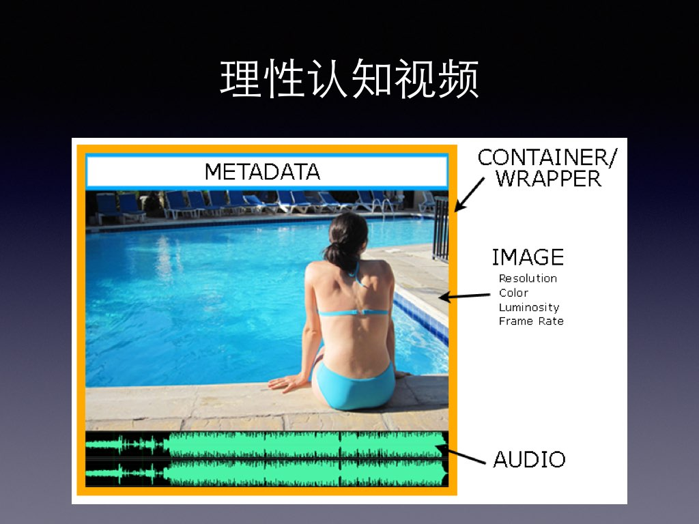

- 内容元素 (Content)
	- 图像 (Image)
	- 音频 (Audio)
	- 元信息 (Metadata) 

- 编码格式 (Codec)
	- Video: H.264, H.265, ...
	- Audio: AAC, HE-AAC, ...

- 容器封装 (Container)
	- MP4, MOV, FLV, RM, RMVB, AVI, ...

任何一个视频 Video 文件，从结构上讲，都是这样一种组成方式：

- 由图像和音频构成最基本的内容元素；
- 图像经过视频编码压缩格式处理（通常是 H.264）；
- 音频经过音频编码压缩格式处理（例如 AAC）；
- 注明相应的元信息（Metadata）；

最后经过一遍容器（Container）封装打包（例如 MP4），构成一个完整的视频文件。

如果觉得难以理解，可以想象成一瓶番茄酱。最外层的瓶子好比这个容器封装（Container），瓶子上注明的原材料和加工厂地等信息好比元信息（Metadata），瓶盖打开（解封装）后，番茄酱本身好比经过压缩处理过后的编码内容，番茄和调料加工成番茄酱的过程就好比编码（Codec），而原材料番茄和调料则好比最原本的内容元素（Content）。

### 视频的实时传输

简而言之，理性的认知视频的结构后，有助于我们理解视频直播。如果视频是一种“有结构的数据”，那么视频直播无疑是**实时传输**这种“有结构的数据”（视频）的方式。

那么一个显而易见的问题是：如何实时（Real-Time）传输这种“有结构的数据”（视频）呢？

这里边一个悖论是：一个经过容器（Container）封装后的视频，一定是不可变的 ( Immutable ) 视频文件，不可变的 ( Immutable ) 的视频文件已经是一个生产结果，根据“相对论”，而这个生产结果显然不可能精确到实时的程度，它已经是一段时空的记忆。

因此视频直播，一定是一个 “边生产，边传输，边消费”的过程。这意味着，我们需要更近一步了解视频从原始的内容元素 ( 图像和音频 ) 到成品 ( 视频文件 ) 之前的中间过程 ( 编码 )。

### 视频编码压缩

不妨让我们来深入浅出理解视频编码压缩技术。

为了便于视频内容的存储和传输，通常需要减少视频内容的体积，也就是需要将原始的内容元素(图像和音频)经过压缩，压缩算法也简称编码格式。例如视频里边的原始图像数据会采用 H.264 编码格式进行压缩，音频采样数据会采用 AAC 编码格式进行压缩。

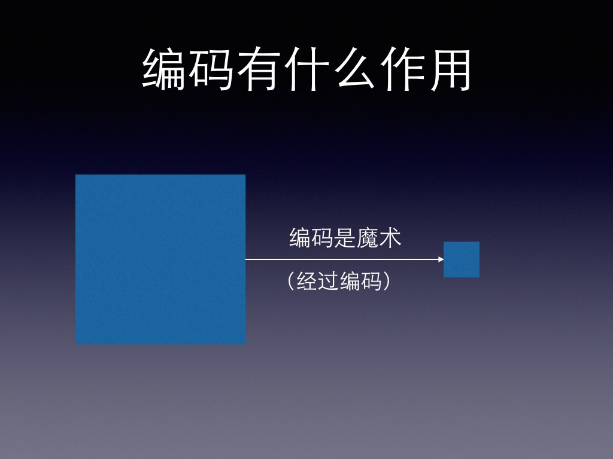

视频内容经过编码压缩后，确实有利于存储和传输; 不过当要观看播放时，相应地也需要解码过程。因此编码和解码之间，显然需要约定一种编码器和解码器都可以理解的约定。就视频图像编码和解码而言，这种约定很简单：

**编码器将多张图像进行编码后生产成一段一段的 GOP ( Group of Pictures ) ， 解码器在播放时则是读取一段一段的 GOP 进行解码后读取画面再渲染显示。**

GOP ( Group of Pictures ) 是一组连续的画面，由一张 I 帧和数张 B / P 帧组成，是视频图像编码器和解码器存取的基本单位，它的排列顺序将会一直重复到影像结束。

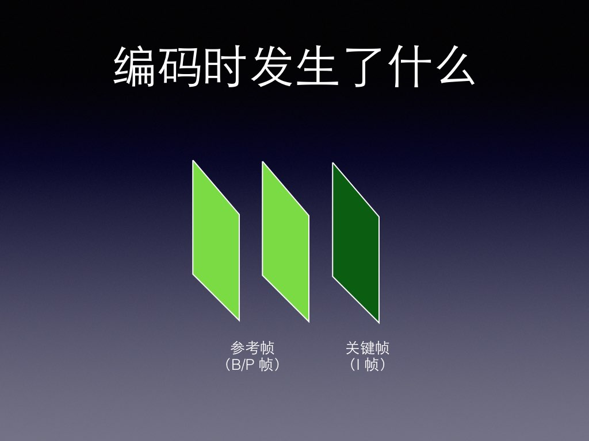

I 帧是内部编码帧（也称为关键帧），P 帧是前向预测帧（前向参考帧），B 帧是双向内插帧（双向参考帧）。简单地讲，I 帧是一个完整的画面，而 P 帧和 B 帧记录的是相对于 I 帧的变化。

**如果没有 I 帧，P 帧和 B 帧就无法解码。**

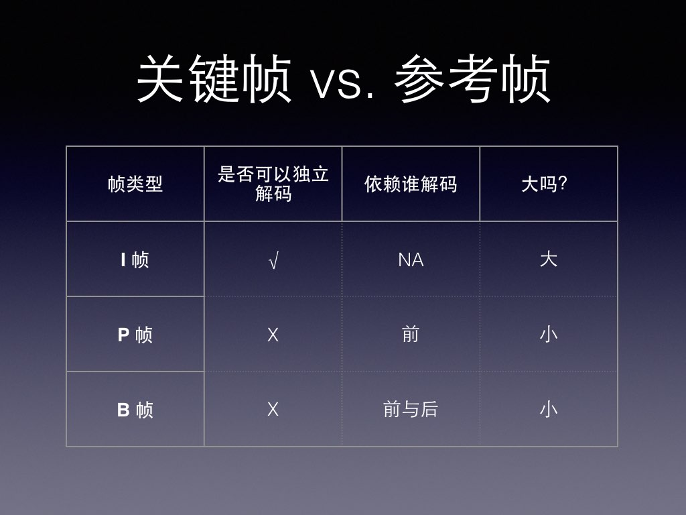

小结一下，一个视频 ( Video ) ，其图像部分的数据是一组 GOP 的集合, 而单个 GOP 则是一组 I / P / B 帧图像的集合。

在这样的一种几何关系中，Video 好比一个 “物体”，GOP 好比 “分子”，I / P / B 帧的图像则好比 “原子”。

想象一下，如果我们把传输一个 “物体”，改成传输一个一个的 “原子”，将最小颗粒以光速传送，那么以人的生物肉眼来感知，将是一种怎样的体验？

### 什么是视频直播？

不难脑洞大开一下，直播就是这样的一种体验。视频直播技术，就是将视频内容的最小颗粒 ( I / P / B 帧，…)，基于时间序列，以光速进行传送的一种技术。

简而言之，直播就是将每一帧数据 ( Video / Audio / Data Frame )，打上时序标签 ( Timestamp ) 后进行流式传输的过程。发送端源源不断的采集音视频数据，经过编码、封包、推流，再经过中继分发网络进行扩散传播，播放端再源源不断地下载数据并按时序进行解码播放。如此就实现了 “边生产、边传输、边消费” 的直播过程。

理解以上两个关于 **视频** 和 **直播** 两个基础概念后，接下来我们就可以一窥直播的业务逻辑了。

### 直播的业务逻辑

如下是一个最精简的一对多直播业务模型，以及各个层级之间的协议。

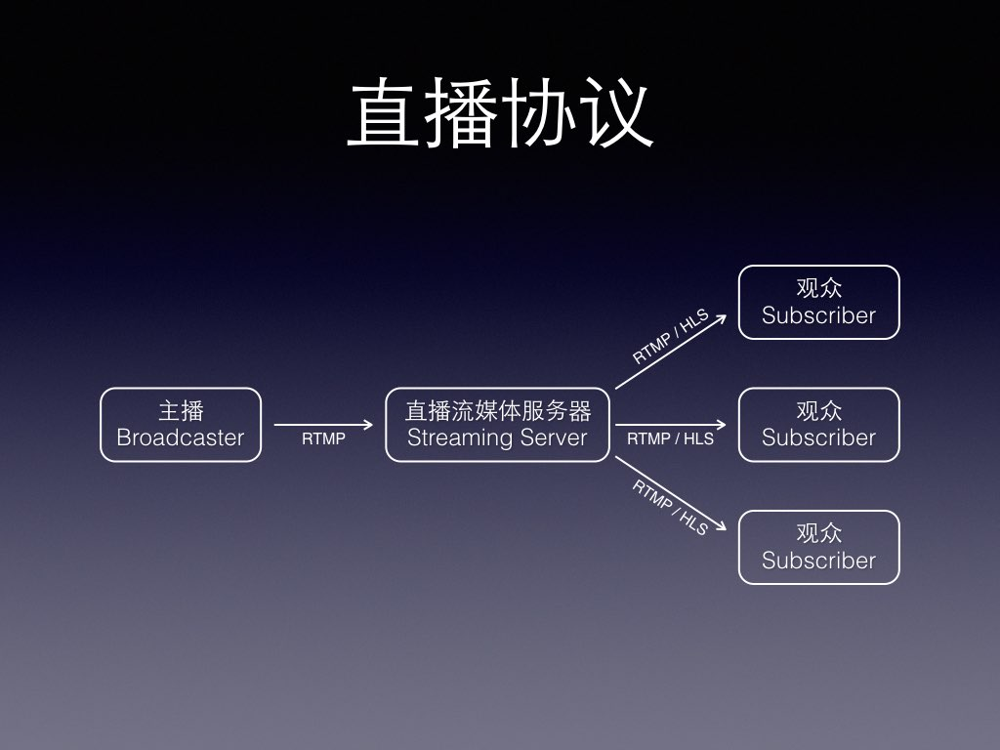

各协议差异对比如下

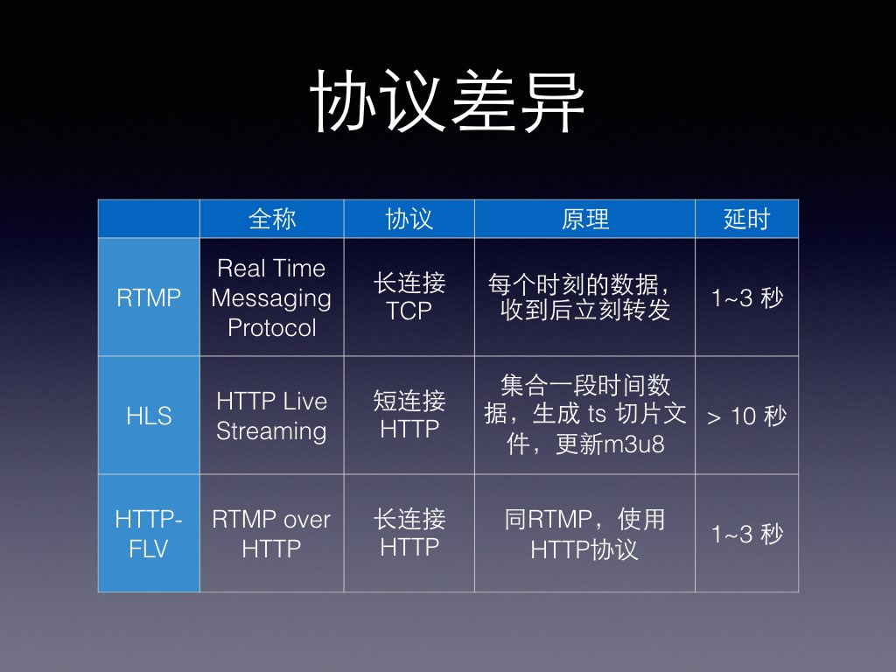

以上就是关于直播技术的一些基础概念。下面我们进一步了解下影响人们视觉体验的直播性能指标。

## 影响视觉体验的直播性能指标

**直播第一个性能指标是延迟**，延迟是数据从信息源发送到目的地所需的时间。

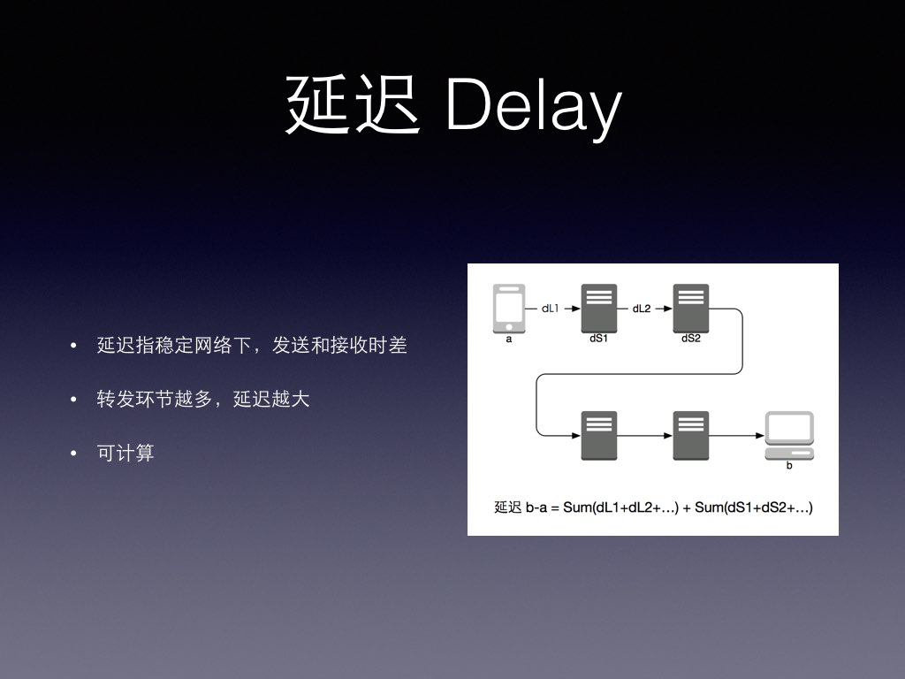

根据爱因斯坦的狭义相对论，光速是所有能量、物质和信息运动所能达到的最高速度，这个结论给传播速度设定了上限。因此，即便我们肉眼感觉到的实时，实际上也是有一定的延迟。

由于 RTMP/HLS 是基于 TCP 之上的应用层协议，TCP 三次握手，四次挥手，慢启动过程中的每一次往返来回，都会加上一次往返耗时 ( RTT )，这些交互过程都会增加延迟。

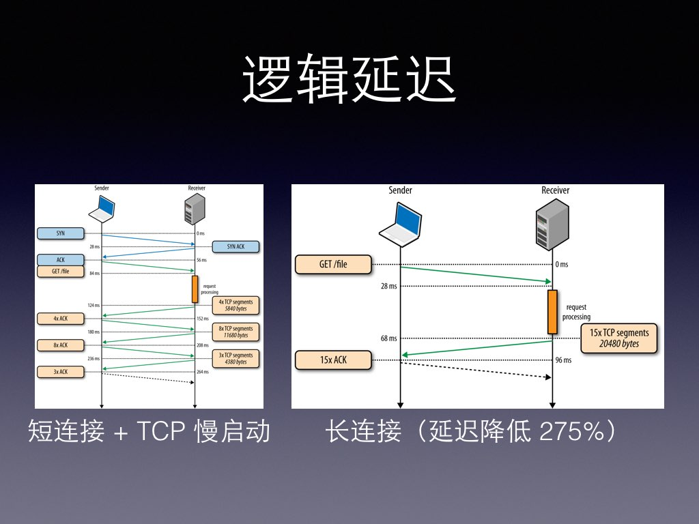

其次根据 TCP 丢包重传特性，网络抖动可能导致丢包重传，也会间接导致延迟加大。

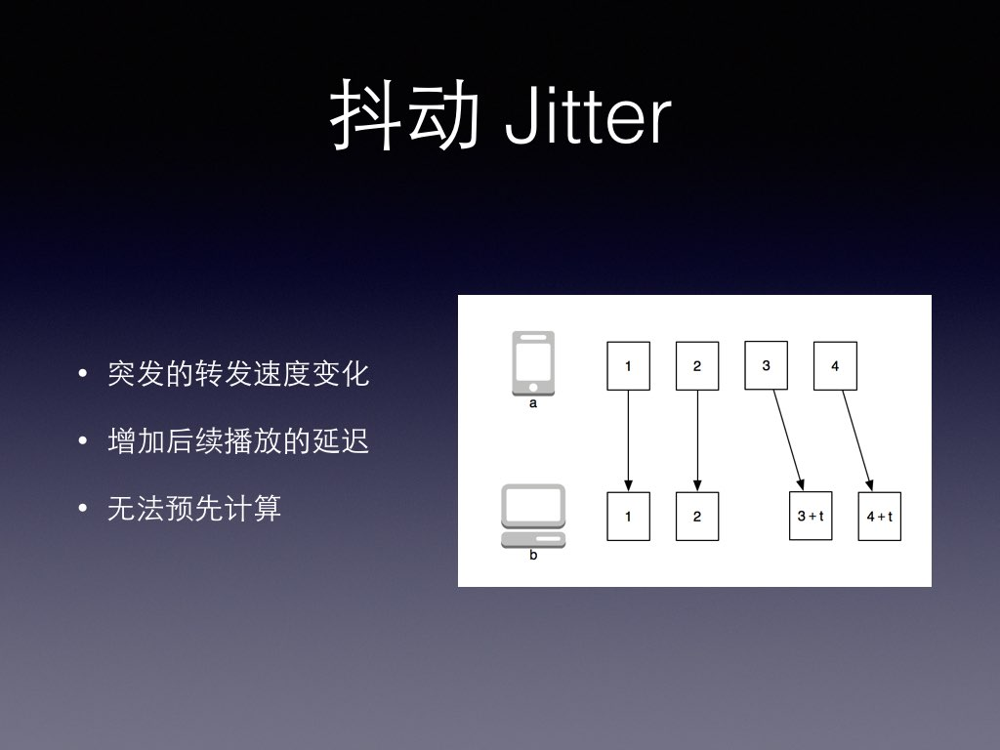

一个完整的直播过程，包括但不限于以下环节：**采集、处理、编码、封包、推流、传输、转码、分发、拉流、解码、播放**。从推流到播放，再经过中间转发环节，延迟越低，则用户体验越好。

**第二个直播性能指标是卡顿**，是指视频播放过程中出现画面滞帧，让人们明显感觉到“卡”。单位时间内的播放卡顿次数统计称之为**卡顿率**。

造成卡顿的因素有可能是推流端发送数据中断，也有可能是公网传输拥塞或网络抖动异常，也有可能是终端设备的解码性能太差。卡顿频次越少或没有，则说明用户体验越好。

**第三个直播性能指标是首屏耗时**，指第一次点击播放后，肉眼看到画面所等待的时间。技术上指播放器解码第一帧渲染显示画面所花的耗时。通常说的 “秒开”，指点击播放后，一秒内即可看到播放画面。首屏打开越快，说明用户体验越好。

如上三个直播性能指标，分别对应一个低延迟、高清流畅、极速秒开 的用户体验诉求。了解这三个性能指标，对优化移动直播 APP 的用户体验至关重要。

那么移动直播场景下具体而言有哪些常见的坑呢？

根据实践总结下来的经验，移动平台上视频直播的坑主要可以总结为两方面：设备差异，以及网络环境这些场景下带来的技术考验。

## 移动直播场景的坑与规避措施

### 不同芯片平台上的编码差异

iOS 平台上无论硬编还是软编，由于是 Apple 一家公司出厂，几乎不存在因为芯片平台不同而导致的编码差异。

然而，在 Android 平台上，Android Framework SDK 提供的 MediaCodec 编码器，在不同的芯片平台上，差异表现很大， 不同的厂家使用不同的芯片，而不同的芯片平台上 Android MediaCodec 表现略有差异，通常实现全平台兼容的成本不低。

另外就是 Android MediaCodec 硬编层面的 H.264 编码画质参数是固定的 baseline，所以画质通常也一般。因此，在 Android 平台下，**推荐是用软编，好处是画质可调控，兼容性也更好**。

### 低端设备如何上高性能地采集和编码？

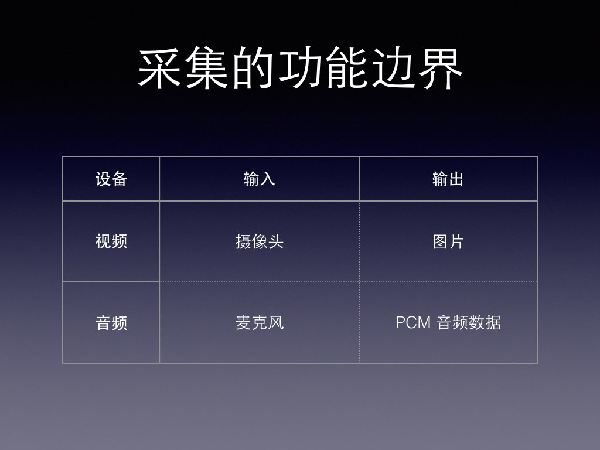

例如 Camera 采集输出的可能是图片，一张图的体积并不会小，如果采集的频次很高，编码的帧率很高，每张图都经过编码器，那么编码器又可能会出现过载。

这个时候，可以考虑在编码前，不影响画质的前提下，进行**选择性丢帧**，以此降低编码环节的功耗开销。

### 弱网下如何保障高清流畅推流

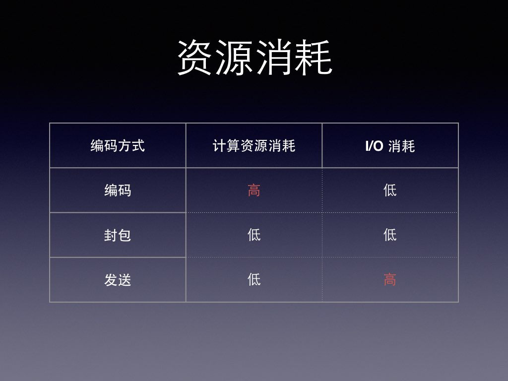

移动网络下，通常容易遇到网络不稳定，连接被重置，断线重连，一方面频繁重连，建立连接需要开销。另一方面尤其是发生 GPRS / 2G / 3G / 4G 切换时，带宽可能出现瓶颈。当带宽不够，帧率较高/码率较高的内容较难发送出去，这个时候就需要可变码率支持。

即在推流端，可检测网络状态和简单测速，动态来切换码率，以保障网络切换时的推流流畅。

其次编码、封包、推流 这一部分的逻辑也可以做微调，可以尝试选择性丢帧，比如优先丢视频参考帧（不丢 I 帧和音频帧 )，这样也可以减少要传输的数据内容，但同时又达到了不影响画质和版视听流畅的目的。

### 美颜等滤镜如何处理

在手机直播场景下，这就是一个刚需。没有美颜功能的手机直播 APP，主播基本不爱用。可以在采集画面后，将数据送给编码器之前，将数据源回调给滤镜处理程序，原始数据经过滤镜处理完后，再送回给编码器进行编码即可。

### 区分直播流状态和业务状态

直播是媒体流、APP 的交互是 API 信令流，两者的状态不能混为一谈。尤其是不能基于 APP 的交互的 API 状态来判断直播流的状态。

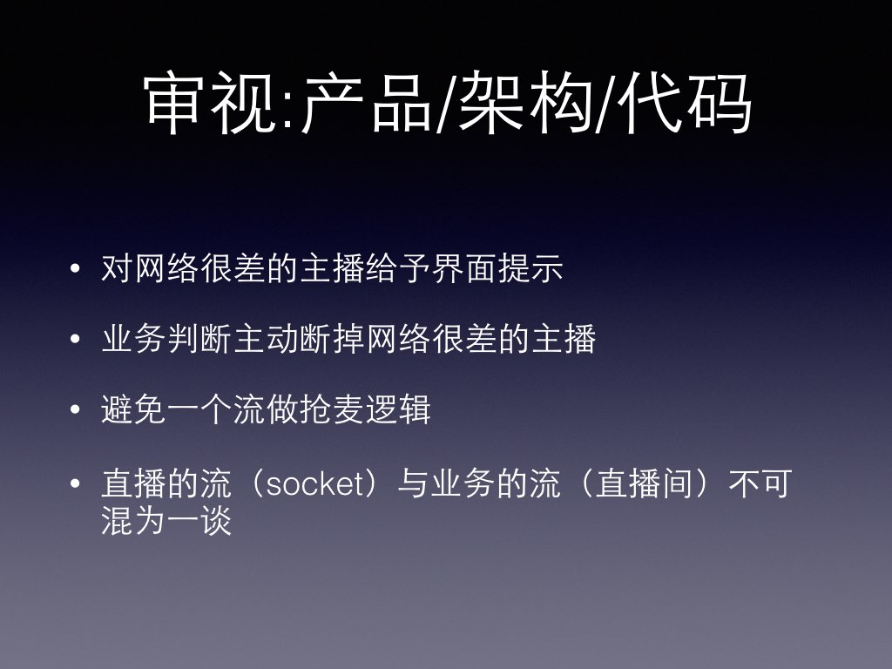

以上是一些移动直播场景下常见的几个坑和规避措施。

## 移动直播场景秒开/流畅/清晰优化经验

### 一、怎么优化打开速度，达到传说中的 “秒开”？

大家可能会看到，市面上某些手机直播 APP 的打开速度非常快，点击一下播放立马就能呈现画面。而某些手机直播 APP，点击播放后要等好几秒以后才能播放。是什么原因导致如此的天壤之别呢？

大部分播放器（例如 Flash Player）都是拿到一个完成的 GOP 后才能解码播放，一些基于 FFmpeg 移植的播放器甚至需要等待音画时间戳同步后才能播放（如果一个直播里边没有音频只有视频相当于要等待音频超时后才能播放画面），这无疑都会加大开始播放等待时长。

究竟，GOP 会对播放产生如何的影响呢？让我们来认知下 GOP 的细节。前面，我们讲到 GOP ( Group of Pictures ) 是一组连续的画面，可以得知 GOP 是一个长度量化单位，**GOP长度（ Length of GOP）也就是2个I帧之间的帧数（通常也称为“关键帧间隔”）**。GOP长度图示如下：

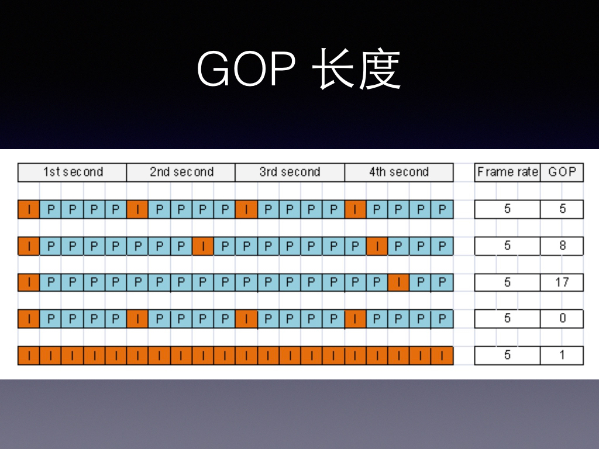

如上图中，展示了不同长度的 GOP，从中也可以看出不同 GOP 长度之间的差异：

- 假设帧率（FPS, Frames per second, 每秒显示帧数）为 5，
	- 当 GOP 值为 5 时, 每个 GOP 包含了 1s 的视频内容数据，每隔 1 秒出现 1 次 I 帧；
	- 当 GOP 值为 8 时，每个 GOP 包含了 1.6s 的视频内容数据，每隔 1.6 秒出现 1 次 I 帧；
	- 当 GOP 值为 17 时，每个 GOP 包含了 3.4s 的视频内容数据，每隔 3.4 秒出现 1 次 I 帧；
	- 当 GOP 值为 0 时，意味着 GOP 长度和帧率一致；
	- 当 GOP 值为 1 时，相邻的两个帧都是 I 帧，压缩一组全 I 帧的图片，几乎就是和 M-JPEG 一样的压缩了，可以得知编码器针对此场景下的纯图片压缩率并不会很高。

假设播放器拿到一个完整的 GOP 才能播放，根据以上图示，我们能够得出如下一些结论：

- **GOP 长度越小，视频内容时长越小，GOP 长度越大，视频内容时长越大**。

当播放器拿到第一个 GOP 时，已经是一小段视频内容了，而这一小段视频内容的时长，就是直播的内容延时。也就是说，终端用户播放画面与拍摄现场画面，至少有一个 GOP 的时间差。

根据这个结论，其实非常能够理解 GOP 长度对直播延迟的影响了。**GOP 长度越小，直播内容延时越小，GOP 长度越大，直播内容延时越大**。无论如何，观众与主播之间，一定会存在因为生产一个 GOP 所需耗时所带来的时间差。

举个例子：

假设主播在 t0 时刻开始直播推流，编码器设置的帧率是 25fps，设置 2 个 I 帧的间隔是 100 个帧距，那么可以计算得出一个 GOP 代表了 4s 的视频内容，即便忽略该 GOP 在传输分发网络中的传输耗时，当播放器完整地拿到第一个 GOP 的时刻已经是 t0 + 4s，此时，播放画面与现场画面的时间差至少是 4s 。另外，该场景下，还有一个细节：如果用户想在第 t0 + 2s 就开始播放，会怎么样呢？答然是播放器会黑屏或着花屏，只有当等到 t0 + 4s 时，才会遇到下一个 I 帧出现，播放器渲染 I 帧时才会出现完整的画面。而在此之前，播放器没有遇到 I 帧，遇到的都是 B / P 帧，这些 P / B 帧没有完整的 I 帧图像可以参考，播放起来就是花屏的效果，如果播放器不解码这些 B / P 帧，那么没有画面显示就是黑屏。

所以，总结下来，是如下两个播放体验问题：

- **至少一个 GOP 的直播内容延时不可避免**；
- 如果 GOP 尚未生成完毕时进行播放，会遇到黑屏（或是花屏）。

针对第一个问题，其实很好解决，推流端编码器或直播服务器将 GOP 长度设置的足够低（比如 0.5s 或是 1s, 不影响编码画质的前提下），播放画面与现场画面的时间差将会越低。

针对第二个问题，单纯修改播放器业务逻辑也解决不了问题。有一种办法是即修改直播服务器，也修改客户端播放器行为逻辑，实现 “**双 I 帧交替秒开优化**”。

所以，秒开可以从以下几个方面考虑：

#### 1) 双 I 帧交替秒开优化

- 修改直播服务器由缓存一个 GOP 为缓存一个 I 帧，快速下发给播放器；
- 修改客户端播放器行为，当遇到一个 I 帧后立即渲染显示，达到秒开，并且是“首帧秒开”；
- 为了防止时间差内首次播放请求没有遇到 I 帧播放会出现花屏，直播服务器与客户端播放器建立连接后，将缓存的 I 帧快速下发，将第二个 I 帧之前的非 I 帧全部丢弃，直到第二个 I 帧之后传输正常的 GOP。

这样，**通过 “双 I 帧交替秒开优化”，即可以减少一个 GOP 的直播内容延时，又可以避免黑屏或花屏达到播放请求一次性秒开**。

#### 2) 在 APP 业务逻辑层面预处理

例如提前做好 DNS 解析（省却几十毫秒），和提前做好**测速选线**（择取最优线路）。经过这样的预处理后，在点击播放按钮时，将极大提高下载性能。

### 3) 直播分发网络（CDN）减少回源延时

传统的 CDN 为了节约中继带宽成本，通常是被动式拉流回源，其间的回源耗时，多数浪费在中继转发上，通常，边缘节点首次从推流服务器回源在秒级至数秒不等。

相比直播服务器传输和缓存一整个 GOP，“双 I 帧” 的缓存和传输成本要小得多。因此，直播分发网络也可以从被动拉流回源模式，改成主动推送模式，以此规避首次请求的中继回源延时。

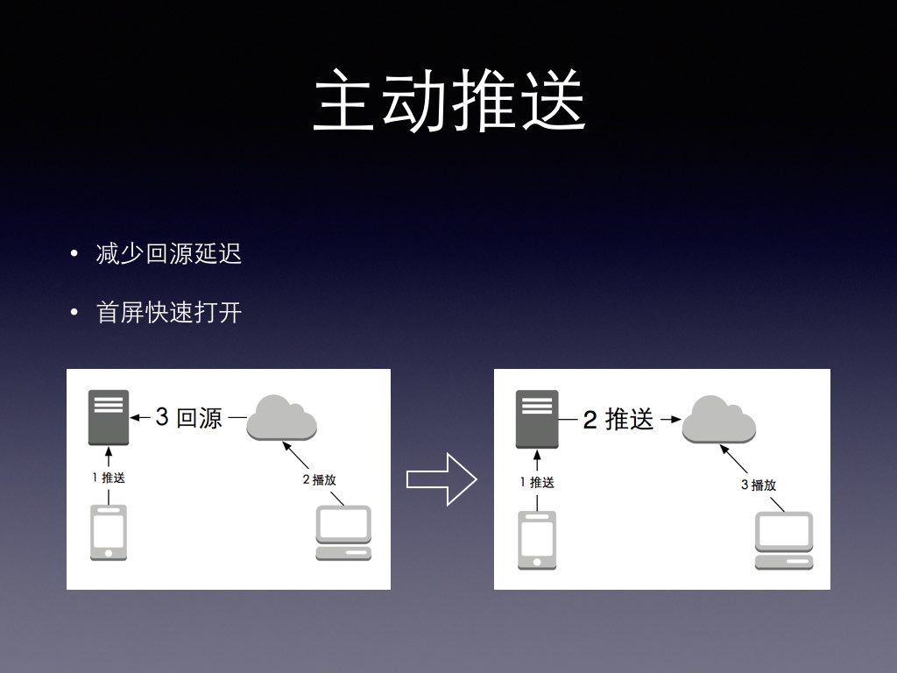

其次，针对多协议输出场景，还可以使用一份源数据，贴近终端就近处理。

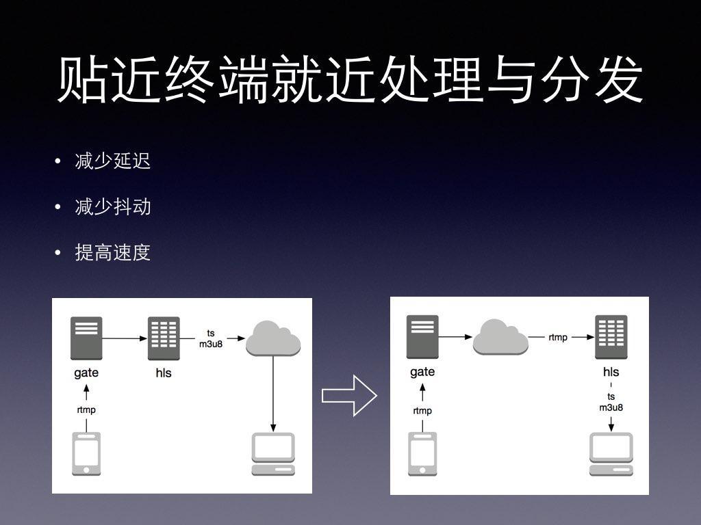

小结：

一方面，可以围绕传输层面做性能优化；另一方面，可以围绕视频编解码原理做播控体验优化。两者可以有效的互为补充，达到甚至超越现有市面上移动直播APP的秒开效果。

### 二、如何保障直播持续播放流畅不卡顿？

“秒开”解决的是直播首次加载的播放体验，如何保障直播持续播放过程中的画面和声音视听流畅呢？因为，一个直播毕竟不是一个 HTTP 一样的一次性请求，而是一个 Socket 层面的长连接维持，直到直到主播主动终止推流。

上述我们讲过卡顿的定义：即播放时**画面滞帧**，触发了人们的视觉感受为“卡”。在不考虑终端设备性能差异的情况下，针对网络传输层面的原因，我们看看如何保障一个持续的直播不卡顿。

这其实是一个直播过程中传输网络不可靠时的容错问题。例如，播放端临时断网了，但又快速恢复了，针对这种场景，播放端如果不做容错处理，很难不出现黑屏或是重新加载播放的现象。

#### 1) 播放缓存队列

为了容忍这种网络错误，并达到让终端用户无感知，**客户端播放器可以考虑构建一个FIFO（先进先出）的缓存队列**，解码器从播放缓存队列读取数据，缓存队列从直播服务器源源不断的下载数据。通常，缓存队列的容量是以时间为单位（比如1s），在播放端网络不可靠时，客户端缓存区可以起到“断网无感”的过渡作用。

显然，这只是一个“缓兵之计”，如果直播服务器边缘节点出现故障，而此时客户端播放器又是长连接，在无法收到对端的连接断开信号，客户端的缓冲区容量再大也不管用了，这个时候就需要结合客户端业务逻辑来做调度。

#### 2) 智能线路调度

重要的是客户端结合服务端，可以做精准调度。在初始化直播推流之前，例如基于 IP 地理位置和运营商的精确调度，分配线路质量最优的边缘接入节点。在直播推流的过程中，可以实时监测帧率反馈等质量数据，基于直播流的质量动态调整线路。

#### 3) 动态码率控制

由于 I 帧是一个完整的画面，而 GOP 中间的那些 P 帧和 B 帧记录的是相对于 I 帧的变化，结合前面我们讲过的GOP长度图示，可以得知：

- GOP 长度不能太大，太长容易导致 GOP 后部帧的画面失真（一般建议 250 个帧距以内）；
- I 帧体积较大，P/B 帧体积较小；
- GOP 长度越小，I 帧越密集，视频内容体积越大；GOP 长度越大，I 帧越稀疏，视频内容体积越小；
- 可以通过加大 GOP 的长度，让 I 帧更稀疏，让 P/B 帧填充更多的区间，少量“大体积”的 I 帧，加上大量 “小体积” 的 P/B 帧，能够达到降低码率从而节省带宽的目的；
- **简而言之，GOP 越长，越有利于减少视频码率，降低其所需要消耗的存储和带宽**。

GOP 长度与 视频码率 和 带宽开销 的关系可以用如下图示说明：

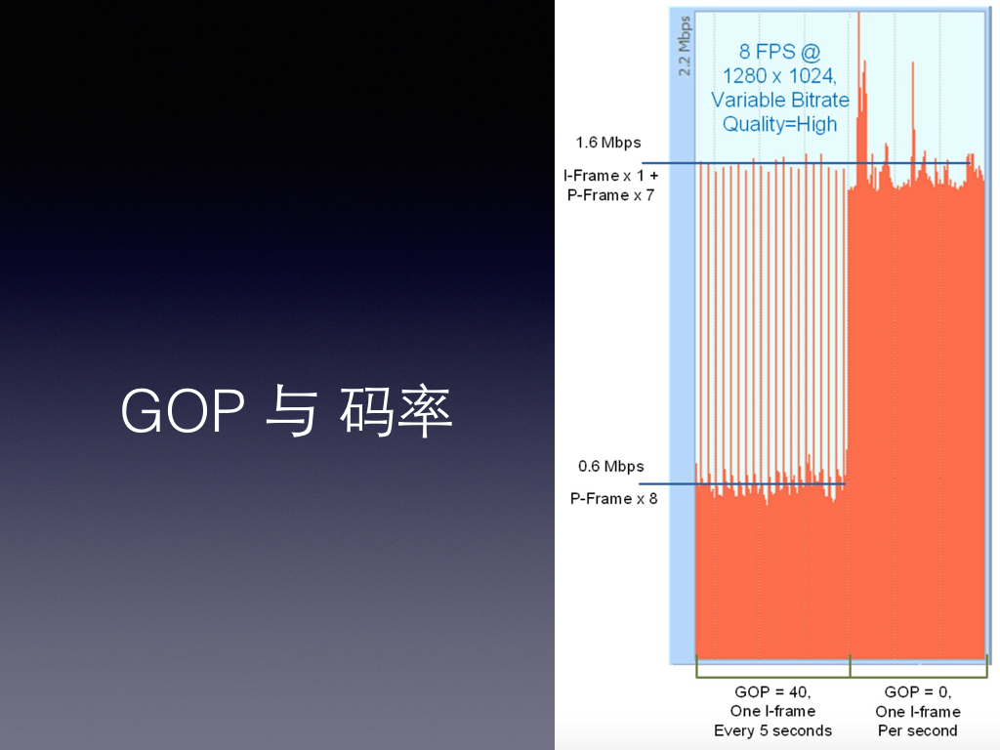

如上图示，每条竖直的垂线显示了每一秒的数据流量。采集端以 8 fps 和 1280 x 1024 的分辨率实时拍摄和发送数据。当 GOP 长度设置为 40 时，则每 5s 出现一个 I 帧，其余的 4s 中只有 P / B 帧没有 I 帧，相比每秒都出现 I 帧的情况，这些 P / B 帧全部加总起来也只占用约其 35% 的带宽（如图左半边部分所示）。

可以得知，GOP 越长，带宽越省。通常，视频播放的流畅与否，和传输网络的带宽质量会有必然的联系，**结合客户端和直播服务端监测两端网络质量，并实时反馈带宽质量给直播服务器，直播服务器就可以因时制宜采取动态调节 GOP 长度，来实现直播过程中适应网络带宽质量变化的码率控制，从而保障直播过程流畅无堵**。

### 三、如何保障移动直播画面持续高清

移动直播，拍摄分为两种场景：一种是较为静止的目标拍摄，另一种是较为运动的目标拍摄。在有较多运动物体或者或在较差的光线条件下，GOP 设置的大小可能会影响视频质量。

I 帧是完整的图像，P 帧是基于像素级分析，块级分析，或矢量分析创建的，通过分析预测移动载体的新位置可以显著降低一帧的大小。通常，I 帧每秒一次，而 P 帧的数量取决于每秒帧数。基于这个原理，我们可以得知：

针对静止目标拍摄，只需少量 I 帧，可以填充大量小微的 P 帧，此时 GOP 较长，也较为节省带宽，但是能够保障视频质量清晰。

针对快速移动的目标进行拍摄，P 帧要记录的运动变化较大，还不如用 I 帧记录全量数据，也就是运动拍摄模式下，I 帧较为密集，GOP 较短，能够保障视频画质的清晰。

为此，在拍摄的过程中，我们可以根据需要，动态的调节编码器的 GOP 长度，用 “智能GOP” 的调节方式，来满足无论是静止拍摄还是运动拍摄场景下的高清画质需求。

**小结**

在深入地了解 GOP 的细节和作用后，我们可以通过调节 GOP 长度来控制直播的内容延时，也可以来控制视频直播的码率用于动态适应网络带宽质量确保流畅，还可以用于静止拍摄／运动拍摄模式中的高清画质保障。

## Q & A (针对Q1答然进行修订)

1. 关键帧设置频率一般是多少？有没有根据接入动态设置？过长首屏秒会很难做到。

> 徐立：关键帧间隔其实是 GOP 长度，如文章内容所述，GOP 越小，延迟越高，GOP 越大，延迟越低。HLS 直播中所需要的 TS 切割粒度最少为一个 GOP。如果帧率是 24 fps, 关键帧间隔/GOP 长度设置为 48 个帧距，那么该 GOP 就会导致 2s 的直播内容延时；如果 GOP 长度设置为 24 个帧距，那么该 GOP 就会导致 1s 的直播内容延迟。GOP 长度不能设置太小比如 1 个帧距, 这将导致 I 帧密集编码器压缩率降低；GOP 长度也不适合设置太大，太长带来编解码的复杂度容易导致 GOP 后部帧的画面失真（一般建议 250 个帧距以内），可以根据直播延时控制的需要，在合理的范围内设置相应的值。如文章中所述，如果即要首屏秒开，可以参考“双 I 帧交替秒开优化” 策略，又要根据接入动态设置，可以参考文末所说的 “码率动态控制” 策略。

### 留言中新增问题解答: 

再请教一下，本地搭建 nginx_rtmp_module 用 obs 推流，为什么本地播放都有3秒以上的延迟，大概是哪方面的问题导致延迟这么高？

> 徐立: obs 不可能会有 3s 的编码延时，由于都是在本地环境，所以也排除网络层面的因素，极有可能是因为 nginx_rtmp_module 直播服务端的缓存导致
